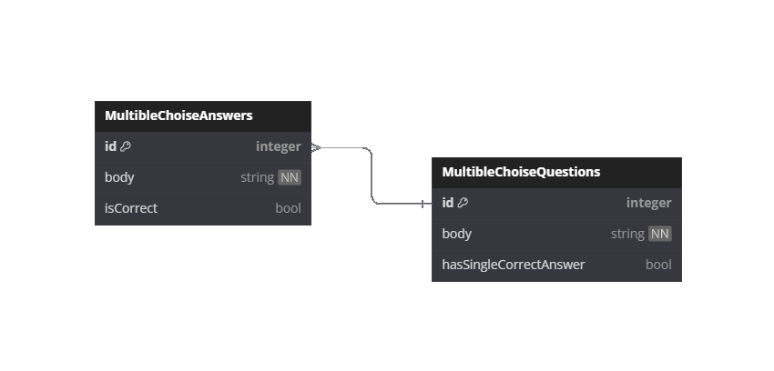

<!--

	Potential name for the project in the Future: * Compty *

	Sounds cute and friendly, could have little computer creature as logo
	and design branding behind that! :D

-->


<div id="introduction" align="center">
	<h1>CompTIA Study</h1>
	<p>A little studying web app for CompTIA certification.</p>
</div>
<p>
	Description of why this site is cool for users and what our goals are!
	Lorem impsum Lorem impsum Lorem impsum Lorem impsum Lorem impsum Lorem impsum
	Lorem impsum Lorem impsum Lorem impsum Lorem impsum Lorem impsum
</p>

## Table of Contents
- [Introduction](#introduction)
	* [Features](#features)
	* [Deployment](#deployment)
	* [Development](#development)
	* [Credits](#credits)

## Features
- [ ] Landing Page
- [ ] Practice Page
- [ ] Test Simulation
- [ ] Authentication
- [ ] User Dashboard
- [ ] Admin Dashboard

### Practice Page
Practice and study by doing different types of exercises.

- [Multible Choise Question](#multible-choise-questions)

#### Multible Choise Questions
You are given set of questions and possible answers to that question. It is stated wheter there is more than one answer or not. There is a progress bar at the top of the page indicating how many questions are left.

## Potential Features
- [ ] Leaderboards
- [ ] Chat / Study Room

## Deployment
To run the project localy follow the steps described bellow
### Project Setup

```sh
npm install
```

### Compile and Hot-Reload for Development

```sh
npm run dev
```

### Compile and Minify for Production

```sh
npm run build
```

## Development
<!-- TODO: Remake this section, It's ugly! Have the catogries be sub headers and use images for each technology. Try making it look more interessting :D -->
I am still fairly new to NextJS, so my conventions may be off and not following best practice.
### File Structure Conventions
 - All the source code is stored within the `./src` directory
 - Images and static assets are stored in the `./public` directory
 - NextJS Server actions and DB related files are in the `./src/services` directory
 - Components and their files follow the `PascalCase` naming convention

### Database
I use a ORM for connecting and interacting with our database and for testing on a local sqlite DB. The questions and answers are stored in this way to allow for more extendability. To achieve this the *Prisma* ORM is used.

#### Diagrams



### Technologies Used
* Frontend
	* React
	* Tailwind.css

* Backend
	* NextJs

* Tooling
	* npm
	* EsLint

## Credits
  - Predojevic Luka (DebuggedMoon)